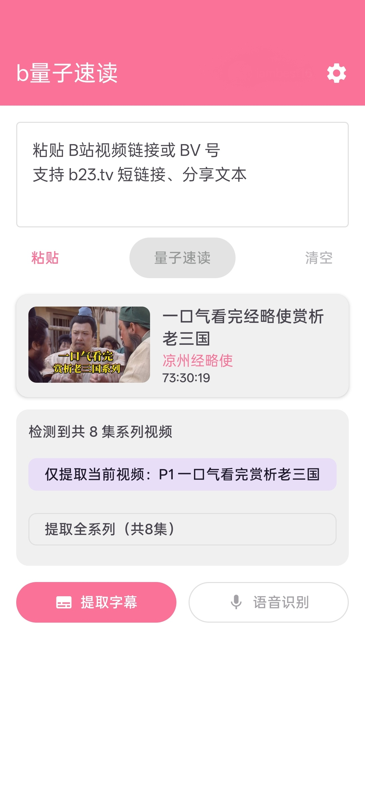
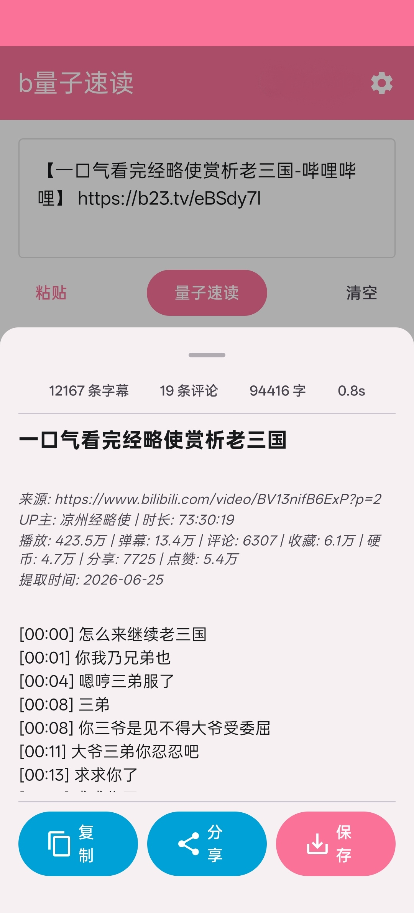

# b量子速读 (bQuantumReader-Android)

**B站 视频内容提取工具 — Android App**

粘贴 B站 视频链接，一键提取字幕和评论，生成结构化 Markdown。支持预览、复制、分享和保存。

> 本项目是 [bQuantumReader](https://github.com/iambest1-hue/bQuantumReader) 的 Android 端实现。浏览器扩展版（Chrome / Edge）请前往原仓库。

---

## 功能

- **链接解析** — 粘贴 B站 视频链接，自动提取 bvid
- **视频信息展示** — 封面、标题、UP主、时长
- **字幕提取** — 调用 B站 CC 字幕 API（WBI 签名），提取带时间轴的字幕内容
- **Markdown 生成** — 自动整理为结构化 Markdown，含视频元信息、时间戳字幕和评论
- **结果操作** — 预览渲染效果、复制到剪贴板、分享到其他 APP、保存为 .md 文件
- **评论提取** — 同步获取视频热门评论
- **B站 登录** — 扫码登录，访问需要登录权限的内容

## 最佳场景：与 AI 对话视频

遇到**长视频**（访谈类、观点类、剧情解析类），不想花一小时看完？这个工具就是为此设计的：

```
1. 复制 B站 视频链接 → 粘贴到本 App
2. 一键提取字幕 + 网友评论
3. 将生成的 Markdown 文件喂给 AI（GPT、DeepSeek、Claude 等）
4. 让 AI 总结视频核心观点，同时结合弹幕/评论分析观众态度
```

你可以像这样与 AI 对话：

> **问**：这个视频的核心观点是什么？UP主论证是否充分？
> **答**：UP主主要认为…，他用了三个论据… 评论区热度最高的观点是…，有 X% 的评论表示赞同/反对…

**效果**：无需看完长视频，就能以对话形式获取视频信息、UP主观点和社区反响，实现"与视频对话"的体验。

## 下载

[**下载 APK**](https://github.com/iambest1-hue/bQuantumReader-Android/releases)

| 要求 | 说明 |
|------|------|
| 系统 | Android 10.0+（API 29+） |
| 架构 | arm64-v8a |
| 大小 | ~4MB |

## 安装

1. 从 [Releases](https://github.com/iambest1-hue/bQuantumReader-Android/releases) 下载最新 APK
2. 在手机上打开 APK 文件
3. 如提示"未知来源应用"，前往设置允许安装
4. 首次打开可能提示"Google Play 保护机制" — 点击 **更多 → 仍要安装**

## 使用方法

1. 打开 APP
2. 复制 B站 视频链接（如 `https://www.bilibili.com/video/BV1xx411c7mD`）
3. 粘贴到输入框，点击解析
4. 查看视频信息
5. 点击 **提取字幕** 获取 CC 字幕内容，或点击 **提取评论** 获取热门评论
6. 在结果面板中预览、复制、分享或保存 Markdown

## 截图




## 技术栈

| 层 | 技术 |
|------|------|
| 语言 | Kotlin |
| UI | Jetpack Compose + Material 3 |
| 架构 | 单 Activity + ViewModel + Repository |
| 网络 | Retrofit + OkHttp |
| 图片 | Coil |
| 依赖注入 | Koin |
| 持久化 | DataStore Preferences |
| 最低 API | Android 10 (API 29) |
| 目标 API | Android 14 (API 34) |

## 构建

### 前置要求

- Android Studio Hedgehog (2023.1.1)+
- JDK 17
- Android SDK 34

### 命令

```bash
git clone https://github.com/iambest1-hue/bQuantumReader-Android.git
cd bQuantumReader-Android
./gradlew assembleDebug
```

### 发布签名

发布 APK 需要配置签名密钥。在 `app/build.gradle.kts` 中添加：

```kotlin
signingConfigs {
    create("release") {
        storeFile = file("your-keystore.jks")
        storePassword = "your-password"
        keyAlias = "your-alias"
        keyPassword = "your-password"
    }
}
```

然后在 `buildTypes.release` 中添加 `signingConfig = signingConfigs.getByName("release")`。

## 项目结构

```
app/
├── MainActivity.kt              # 单 Activity
├── App.kt                       # Application + Koin
├── ui/
│   ├── screen/                  # 页面（Home、Settings）
│   ├── component/               # 组件（LinkInput、VideoInfoCard 等）
│   └── theme/                   # Material3 主题
├── data/
│   ├── api/                     # B站 API + WBI 签名 + MD5
│   ├── model/                   # 数据模型
│   ├── repository/              # 数据仓库
│   └── local/                   # Cookie / 凭证存储
├── domain/
│   ├── LinkParser.kt            # URL 解析
│   └── MarkdownGen.kt           # Markdown 生成
└── util/                        # 剪贴板、文件工具
```

## 相关项目

- [bQuantumReader](https://github.com/iambest1-hue/bQuantumReader) — 浏览器扩展版（Chrome / Edge），支持本地 Whisper 语音识别

---

## 关于

- **项目地址**：https://github.com/iambest1-hue/bQuantumReader-Android
- **作者**：[iambest1-hue](https://github.com/iambest1-hue)

---

## 自愿捐助

如果这个项目对你有帮助，欢迎请作者喝杯咖啡 ☕

| 微信 | 支付宝 |
|------|--------|
|  |  |

## 许可证

[MIT License](LICENSE)
